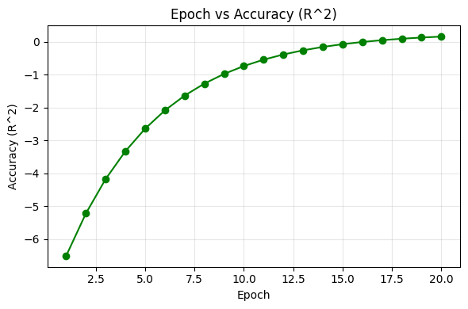
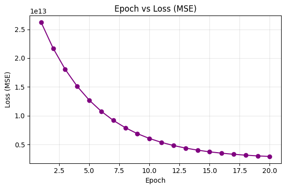
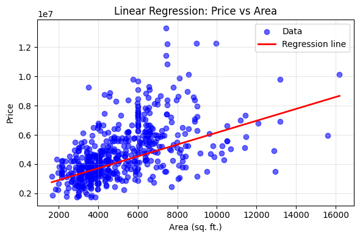

# 🏠 Housing Price Prediction using Linear Regression

This project predicts housing prices based on different features (area, bedrooms, bathrooms, location, etc.) using **Linear Regression**.  
It also evaluates model performance using **R² score, Mean Squared Error (MSE), and custom accuracy** (within ±10%).  
Additionally, the project simulates **epochs** by re-training the model multiple times with different train/test splits, and plots **Accuracy vs Epoch** and **Loss vs Epoch** graphs.

---
## 📂 Project Structure

Assignment2/

│── Housing.csv                 # Dataset (input file)  
│── housing_prediction.ipynb    
│── README.md                   # Documentation  
│  
├── price_vs_area.png           # Scatter plot of Price vs Area with regression line  
├── epoch_vs_accuracy.png       # Accuracy (R²) vs Epoch graph  
└── epoch_vs_loss.png           # Loss (MSE) vs Epoch graph  

---

# ✨ Features

## 🔹 Custom Dataset Handling
- Loads housing dataset (`Housing.csv`)  
- Uses only two columns: **Area (sq.ft.)** and **Price**  
- Cleans data by removing missing values  

## 🔹 Preprocessing
- Extracts features (`area`) and target (`price`)  
- Standardizes feature values for stable gradient descent  

## 🔹 Linear Regression (From Scratch)
- Implements **Batch Gradient Descent** without using scikit-learn  
- Learns slope (`w`) and intercept (`b`)  
- Converts parameters back to original scale (price per sq.ft.)  

## 🔹 Model Evaluation
- Tracks **Loss (MSE)** per epoch  
- Computes **Accuracy (R² score)** per epoch  
- Prints progress for each epoch  

## 🔹 Visualizations  

### 📈 Epoch vs Accuracy (R²)  

  

  

### 📉 Epoch vs Loss (MSE)  

  

  

### 📊 Scatter Plot: Price vs Area with Regression Line  

  

  

